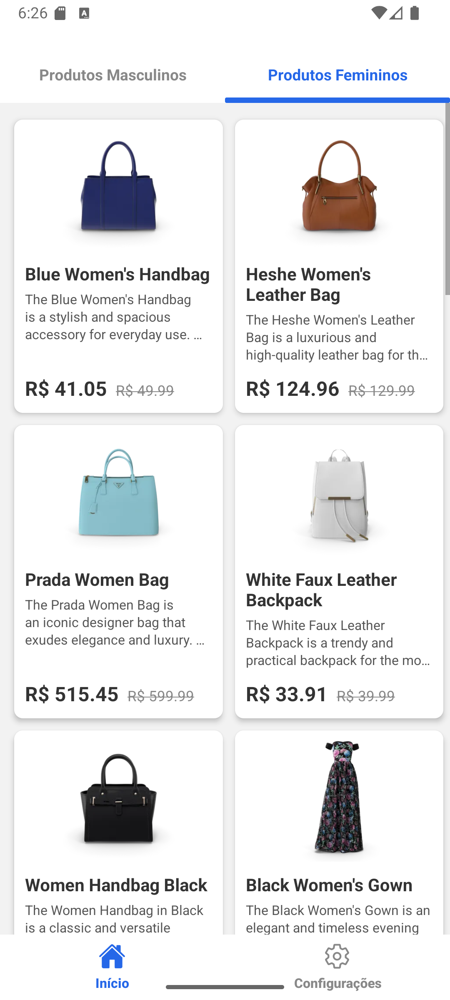
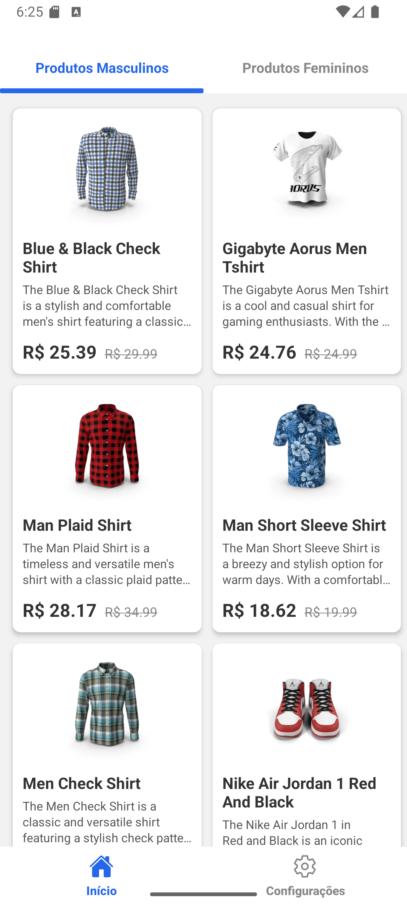

# 🛍️ Catálogo Interativo Mobile com Listagem de Produtos por Categoria

Este projeto apresenta a primeira versão de um **aplicativo mobile responsivo e leve**, desenvolvido em **React Native com Expo**, com o objetivo de simular um catálogo de produtos para uma loja online. O foco principal está na **organização de produtos por categoria**, **navegação intuitiva entre telas** e o **consumo eficiente de uma API REST real**.

O aplicativo foi construído com atenção aos detalhes de UI/UX, replicando fielmente layouts definidos em Figma, e aplicando boas práticas de desenvolvimento mobile.

---

## ✨ Funcionalidades Implementadas

* **Tela de Login Robusta**:
    * Simulação de autenticação com validação de campos (usuário/senha).
    * Feedback visual para campos obrigatórios (borda vermelha e mensagem de erro).
    * Funcionalidade de **mostrar/ocultar senha** com ícone de olho.
    * Mensagem de erro genérica para credenciais inválidas.
    
* **Listagem de Produtos por Categoria (Abas Superiores)**:
    * Organização clara dos produtos em categorias "Masculino" e "Feminino" via navegação por abas superiores (`MaterialTopTabNavigator`).
    * Exibição de cards de produtos com imagem, título, **descrição breve**, preço com desconto e preço original riscado.
    * Estados de carregamento, erro e lista vazia com feedback visual adequado.
    
* **Navegação Inferior (Bottom Tab Navigator)**:
    * Navegação persistente e intuitiva entre as seções "Início" (lista de produtos) e "Configurações".
    * Ícones dinâmicos que mudam de estado (foco).
    
* **Tela de Detalhes do Produto Rica**:
    * Exibição completa de um produto individual, incluindo imagem principal, título, **descrição detalhada**, preço com desconto e preço original riscado.
    * Layout limpo e focado na informação do produto.
    
* **Tela de Configurações Personalizada**:
    * Exibe dados simulados do perfil do usuário (nome, e-mail) com uma imagem de perfil que se sobrepõe ao card de conteúdo.
    * Opções de menu estilizadas para "Meus dados", "Notificações" e "Termos de uso".
    * Botão "Sair da conta" com confirmação, que limpa os dados de sessão.
    
* **Consumo de API REST Real**:
    * Integração com a API pública [DummyJSON](https://dummyjson.com/docs) para buscar dinamicamente os dados de produtos.
    * Utiliza Axios para gerenciar as requisições HTTP, com tratamento de erros.

---

## 🛠️ Tecnologias Utilizadas

Este projeto foi desenvolvido utilizando as seguintes tecnologias e bibliotecas:

* **[React Native](https://reactnative.dev/)**: Framework JavaScript para construção de aplicativos móveis nativos para iOS e Android a partir de uma única base de código.
* **[Expo](https://expo.dev/)**: Um conjunto de ferramentas e serviços que facilita o desenvolvimento, construção e implantação de aplicativos React Native, abstraindo complexidades da configuração nativa.
* **[Axios](https://axios-http.com/)**: Um cliente HTTP leve e baseado em Promises, utilizado para fazer requisições a APIs REST de forma eficiente e com bom tratamento de erros.
* **[React Navigation](https://reactnavigation.org/)**: A solução de navegação padrão e altamente personalizável para aplicativos React Native, incluindo `NativeStack`, `BottomTabs` e `MaterialTopTabs`.
* **[Redux Toolkit](https://redux-toolkit.js.org/)**: O conjunto de ferramentas oficial e opinativo para desenvolvimento Redux, simplificando o gerenciamento de estado global e padrões de dados assíncronos (com `createAsyncThunk`).
* **[@expo/vector-icons](https://docs.expo.dev/guides/icons/)**: Uma vasta biblioteca de ícones vetoriais integrada ao Expo, essencial para os elementos de UI (olho da senha, setas, ícones de navegação).
* **[react-native-safe-area-context](https://github.com/th3rdwave/react-native-safe-area-context)**: Biblioteca para lidar com as áreas seguras do dispositivo (como o notch e a barra de gestos inferior/superior), garantindo que o conteúdo da UI não seja cortado.

---

## 📦 Como Instalar e Rodar o Projeto

Siga os passos abaixo para ter o projeto funcionando em sua máquina de desenvolvimento:

### Pré-requisitos

Certifique-se de ter as seguintes ferramentas instaladas globalmente em seu sistema:

* **[Node.js](https://nodejs.org/en/) (versão LTS recomendada)**
* **[Expo CLI](https://docs.expo.dev/get-started/installation/)**:
    ```bash
    npm install -g expo-cli
    ```

### Instalação

1.  **Clone o Repositório:**
    ```bash
    git clone [https://github.com/SEU_USUARIO/SEU_REPOSITORIO.git](https://github.com/SEU_USUARIO/SEU_REPOSITORIO.git)
    cd SEU_REPOSITORIO # Navegue até a pasta raiz do projeto
    ```
    (Lembre-se de substituir `SEU_USUARIO` e `SEU_REPOSITORIO` pelo seu próprio nome de usuário e nome do repositório no GitHub).

2.  **Instale as Dependências:**
    ```bash
    npm install
    # ou, se preferir usar o Yarn:
    # yarn install
    ```

### Execução do Aplicativo

Para iniciar o servidor de desenvolvimento do Expo e rodar o aplicativo deve-se estar dentro da pasta mobile e executar o seguinte comando:

```bash
npx expo start
